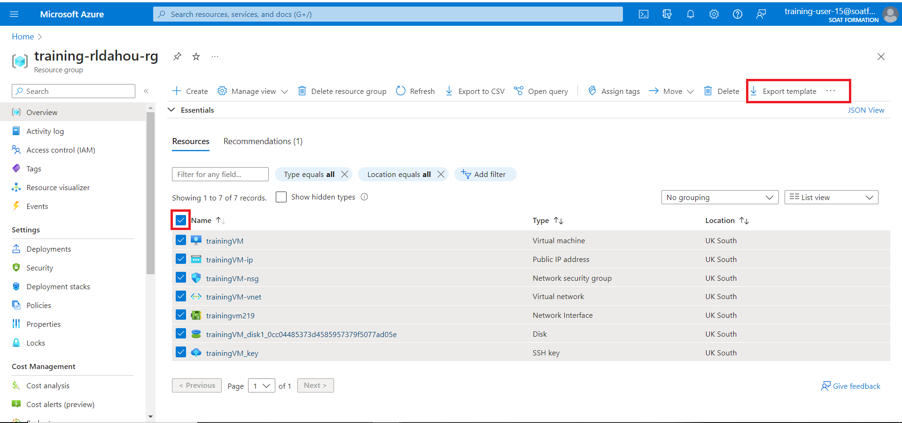
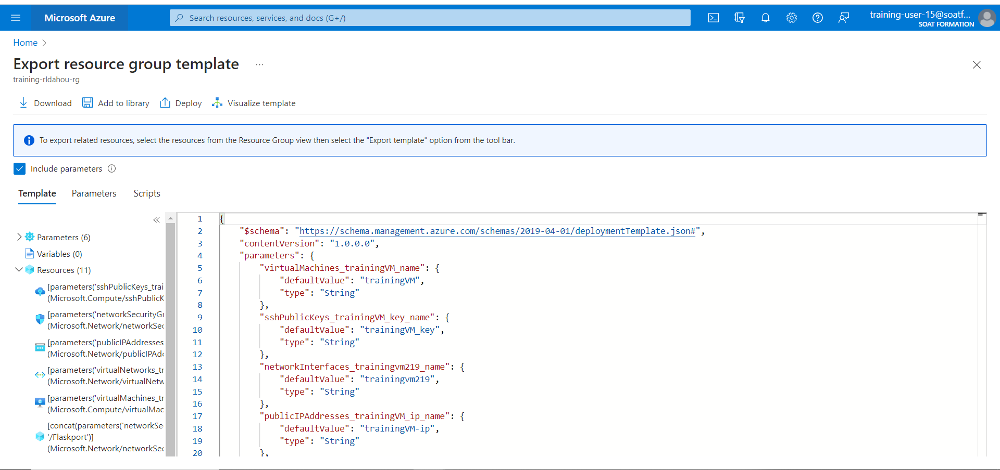

## Template pour créer un Storage Account

````
{
    "$schema": "https://schema.management.azure.com/schemas/2019-04-01/deploymentTemplate.json#",
    "contentVersion": "1.0.0.0",
    "parameters": {
      "storageAccountName": {
        "type": "string",
        "metadata": {
          "description": "Specifies the name of the Azure Storage account."
        }
      },
      "containerName": {
        "type": "string",
        "defaultValue": "logs",
        "metadata": {
          "description": "Specifies the name of the blob container."
        }
      },
      "location": {
        "type": "string",
        "defaultValue": "[resourceGroup().location]",
        "metadata": {
          "description": "Specifies the location in which the Azure Storage resources should be deployed."
        }
      }
    },
    "resources": [
      {
        "type": "Microsoft.Storage/storageAccounts",
        "apiVersion": "2019-06-01",
        "name": "[parameters('storageAccountName')]",
        "location": "[parameters('location')]",
        "sku": {
          "name": "Standard_LRS",
          "tier": "Standard"
        },
        "kind": "StorageV2",
        "properties": {
          "accessTier": "Hot"
        },
        "resources": [
          {
            "type": "blobServices/containers",
            "apiVersion": "2019-06-01",
            "name": "[concat('default/', parameters('containerName'))]",
            "dependsOn": [
              "[parameters('storageAccountName')]"
            ]
          }
        ]
      }
    ]
  }
````

### ``Exécutez le Template``

``$rg = 'training-votrenom-rg'``

``New-AzResourceGroupDeployment -Name 'new-storage' -ResourceGroupName $rg  -TemplateFile 'storage.json'``

### Générer un tamplate à partir de son groupe de ressources






### ``Pour en Savoir plus``

Template 

https://github.com/renauddahou/azure-quickstart-templates


How to deploy

Azure CLI or Powershell is recommended to deploy the template.

Using Azure CLI
https://azure.microsoft.com/en-us/documentation/articles/xplat-cli-azure-resource-manager/

Using Powershell
https://azure.microsoft.com/en-us/documentation/articles/powershell-azure-resource-manager/


Créate template with vscode

https://learn.microsoft.com/en-us/azure/azure-resource-manager/templates/quickstart-create-templates-use-visual-studio-code?tabs=PowerShell


```python

```
