## Créez un projet dans Azure Devops Organizations 

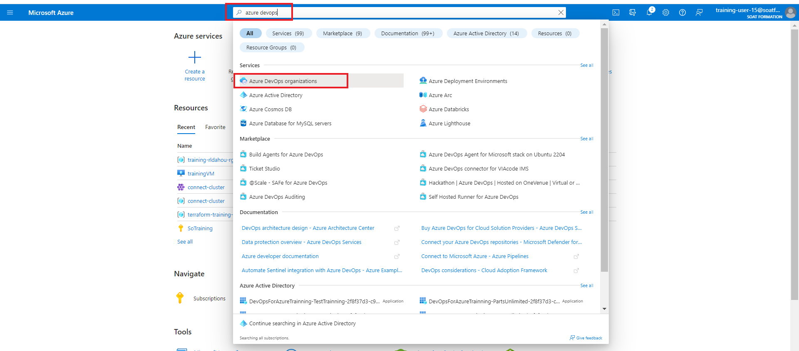

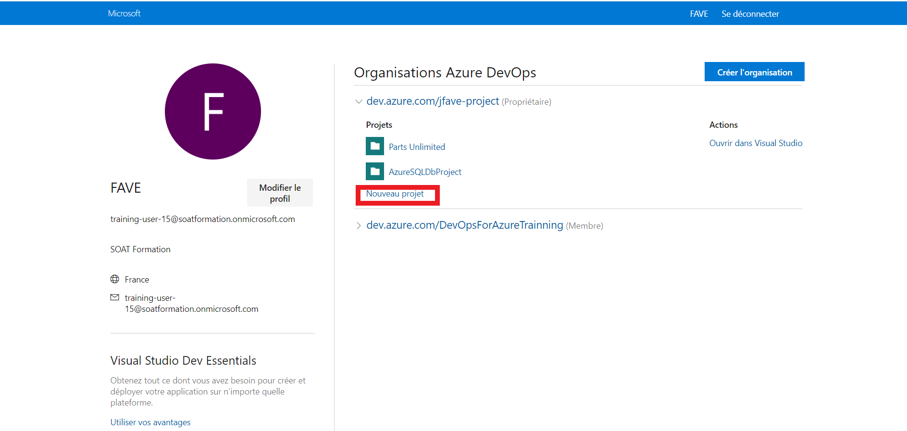

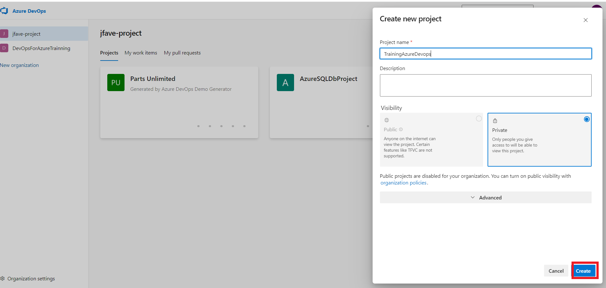

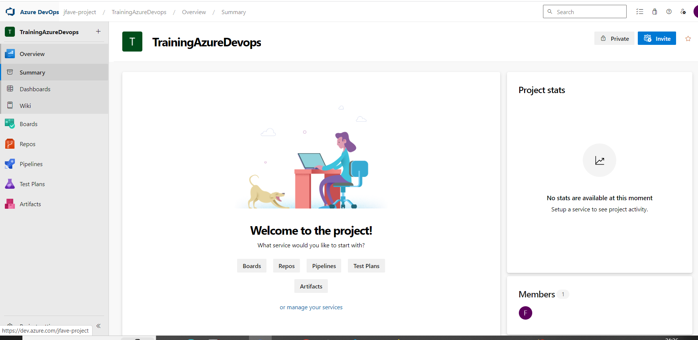

## Créer son token

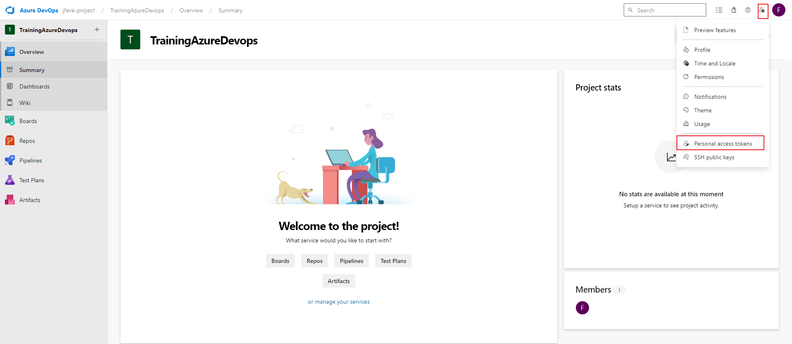

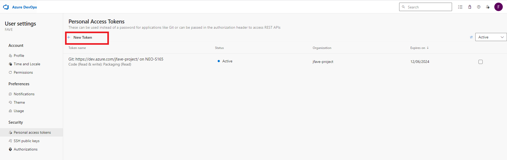

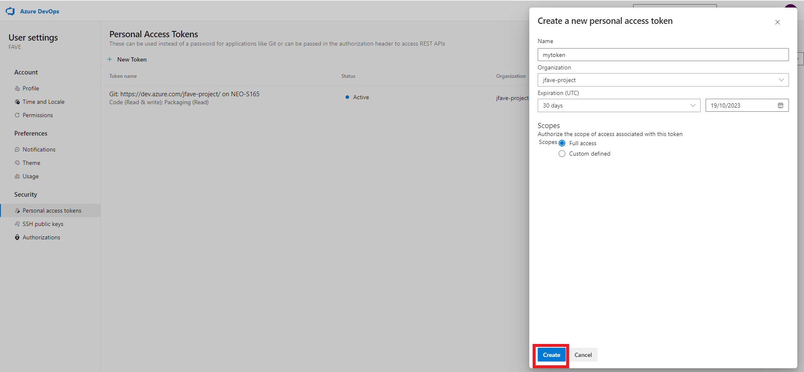

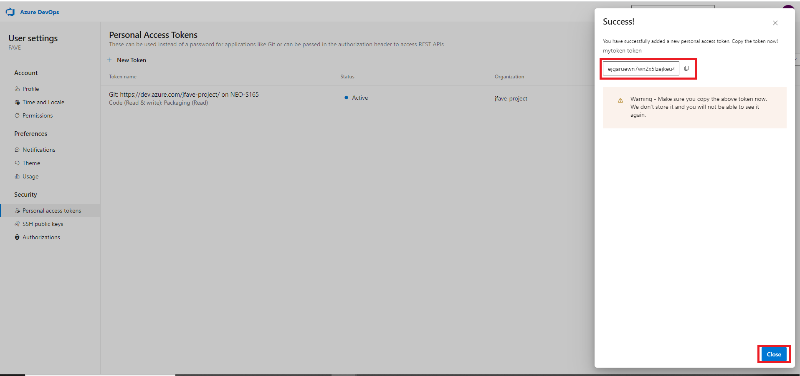

l3zi4bf3exaewd6xil2ta7xjvxec2uqz44iffimdb7xde4y7kuuq

## Créez un Agent pool 

#### Cet agent pool sera installer sur notre serveur CI  VMtraining

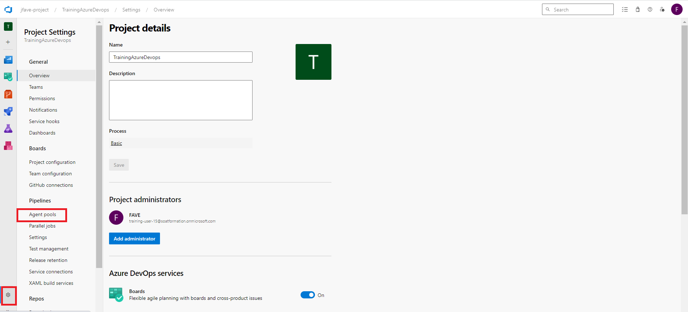

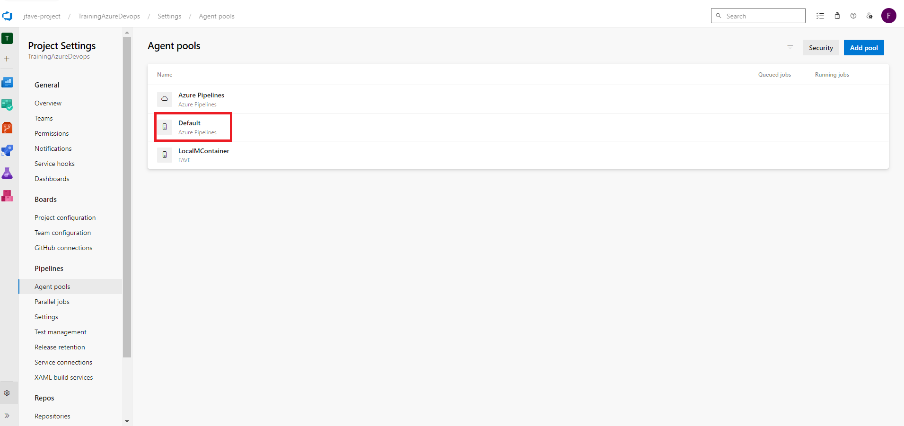

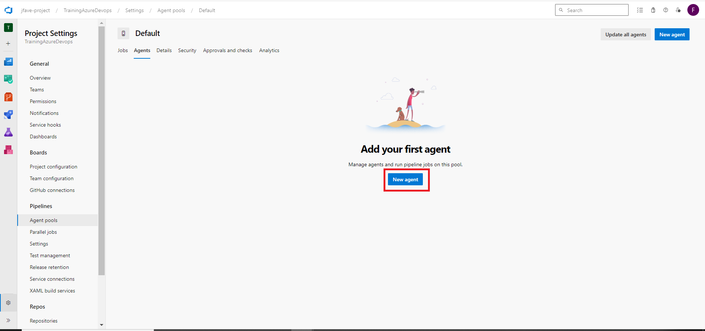

### ``Les commandes suivante son à executer sur votre serveur CI en fonction de l'Os``

#### Sous WINDOWNS

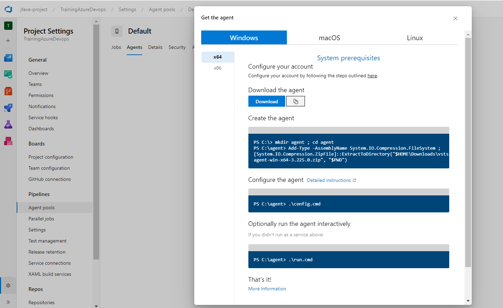

### ``Téléchargement du binaire``

``az login``

``$url = "https://vstsagentpackage.azureedge.net/agent/3.225.0/vsts-agent-win-x64-3.225.0.zip"``

``$outputPath = "C:\Users\ASUS STRIX\Downloads\vsts-agent-win-x64-3.225.0.zip"``

``Invoke-WebRequest -Uri $url -OutFile $outputPath``


### ``Création de l'agent``
``PS C:\> mkdir agent ; cd agent``

``PS C:\agent> Add-Type -AssemblyName System.IO.Compression.FileSystem ; [System.IO.Compression.ZipFile]::ExtractToDirectory("$HOME\Downloads\vsts-agent-win-x64-3.225.0.zip", "$PWD")
``
### ``Configuration de l'agent``

``PS C:\agent> .\config.cmd``

``Entrez URL serveur > https://dev.azure.com/jfave-project/``

``Entrez type d’authentification (appuyez sur Entrée pour PAT) >``


``Entrez jeton d'accès personnel > ***************************************************``

``Entrez pool d'agents (appuyez sur Entrée pour default) >``

``Entrez nom de l’agent (appuyez sur Entrée pour DESKTOP-FTU31JP) >``

``Entrez dossier de travail (appuyez sur Entrée pour _work) >``

``Entrez exécuter l’agent en tant que service ? (O/N) (appuyez sur Entrée pour N) >``

``Entrez configurer l’ouverture de session automatique et exécuter l’agent au démarrage ? (O/N) (appuyez sur Entrée pour N) >``

### ``Exécutez éventuellement l'agent de manière interactive``

``PS C:\agent> .\run.cmd``


#### Sous LINUX

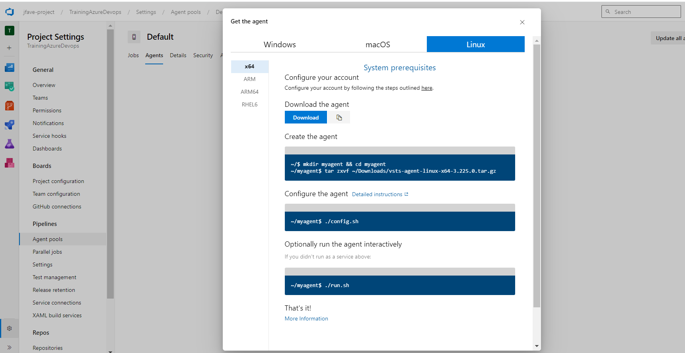

### ``Connectez-vou en SSH sur VMtraining``


``~/$ wget https://vstsagentpackage.azureedge.net/agent/3.225.0/vsts-agent-linux-x64-3.225.0.tar.gz``
    
``~/$ mkdir myagent && cd myagent``

``~/myagent$ tar zxvf ~/Downloads/vsts-agent-linux-x64-3.225.0.tar.gz``

``~/myagent$ ./config.sh``

``~/myagent$ ./run.sh``

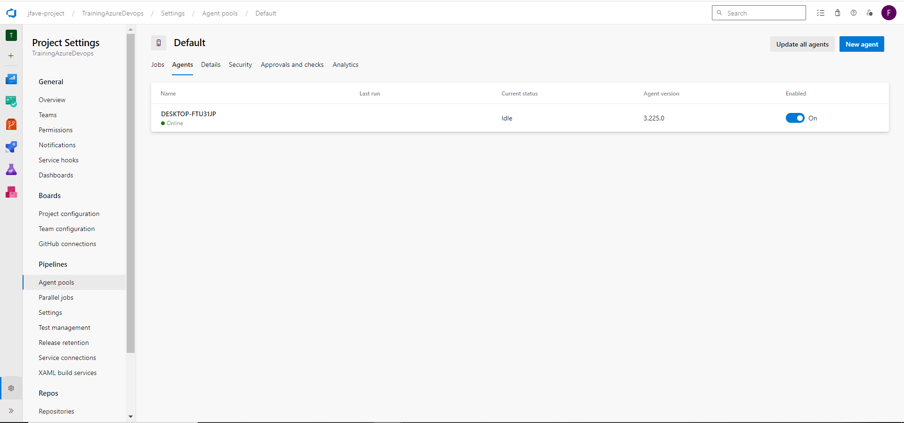


```python

```
