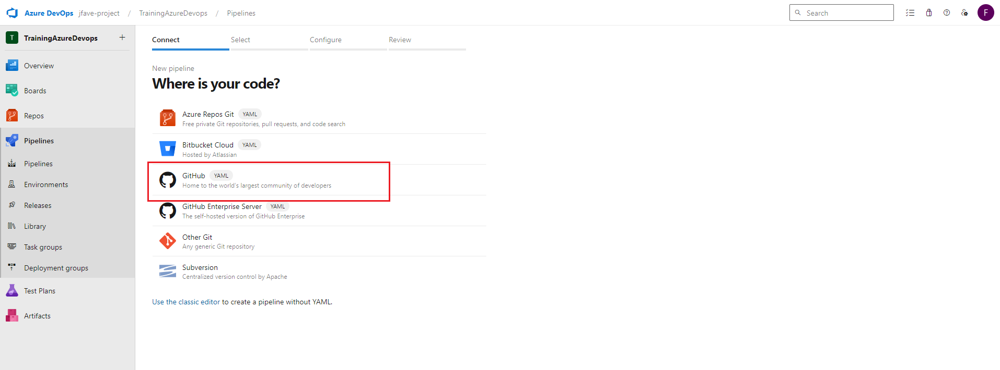
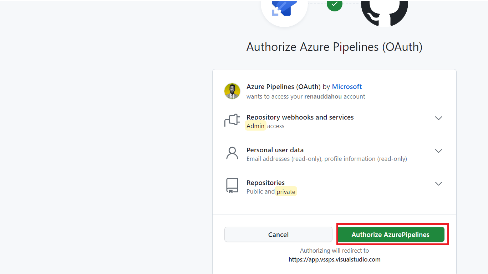
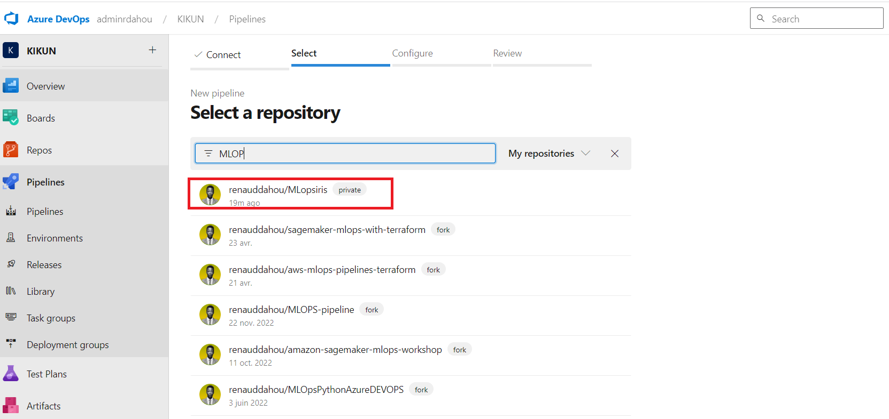
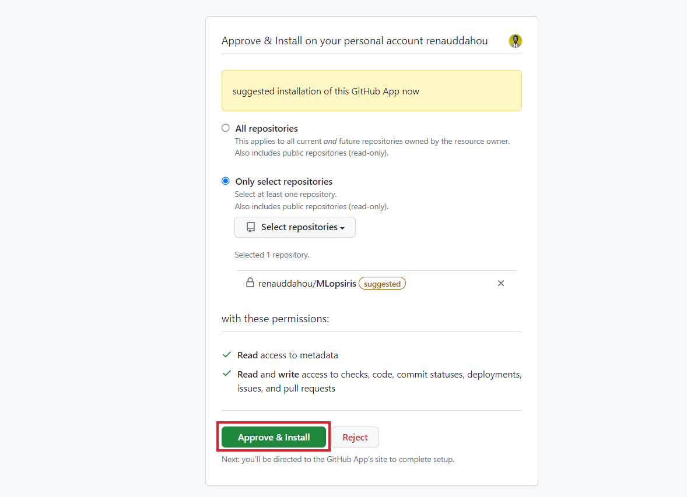

## Création de pipeline






#### ``Nous allons ensemble construire ce pipeline  de bout en bout afin de builder, tester  et publier  notre application``

```
# Starter pipeline
# Start with a minimal pipeline that you can customize to build and deploy your code.
# Add steps that build, run tests, deploy, and more:
# https://aka.ms/yaml

trigger:
- master

pool:
  name: Default
steps:
- task: CopyFiles@2
  inputs:
    Contents: '**'
    TargetFolder: '$(Build.ArtifactStagingDirectory)'
    OverWrite: true
- task: CmdLine@2
  displayName: 'Test code quality'
  inputs:
    script: |
      echo Test code quality
      python3 flake8.py
  continueOnError: false
- task: CmdLine@2
  displayName: 'Build Docker images'
  inputs:
    script: |
      echo Build Docker images
      sudo docker build -t flasapp .
    workingDirectory: '$(Build.ArtifactStagingDirectory)'
  continueOnError: false
- task: CmdLine@2
  displayName: 'Test container'
  inputs:
    script: |
      echo Test container
      sudo docker run --rm -p 8000:8000 flasapp bash -c "python3 app.py & sleep 2 && curl -X POST -d 'name=Renaud' http://localhost:5000/hello"
    workingDirectory: '$(Build.ArtifactStagingDirectory)'
  continueOnError: false
- task: CmdLine@2
  displayName: 'Achives file'
  inputs:
    script: 'zip -r app.zip ./*'
    workingDirectory: '$(Build.ArtifactStagingDirectory)'
- task: PublishBuildArtifacts@1
  displayName: 'Publish artifact'
  inputs:
    PathtoPublish: '$(Build.ArtifactStagingDirectory)'
    ArtifactName: 'drop'
    publishLocation: 'Container'
  continueOnError: false
```


```python

```
