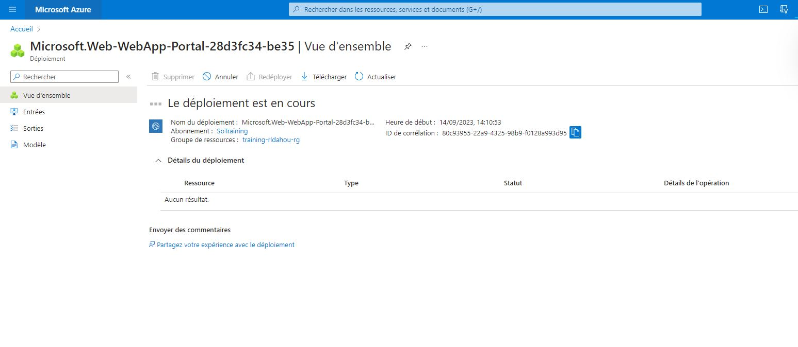

### Création d'un App Service





### Amlioration de notre pipeline pour déployer en App Service


```
- task: CmdLine@2
      displayName: 'Run as Appservice'
      inputs:
        script: 'az webapp deploy --name $APP_SERVICE_NAME --resource-group $RESOURCE_GROUP_NAME --src-path $(Build.ArtifactStagingDirectory)/app.zip'
           
```


```python

```
